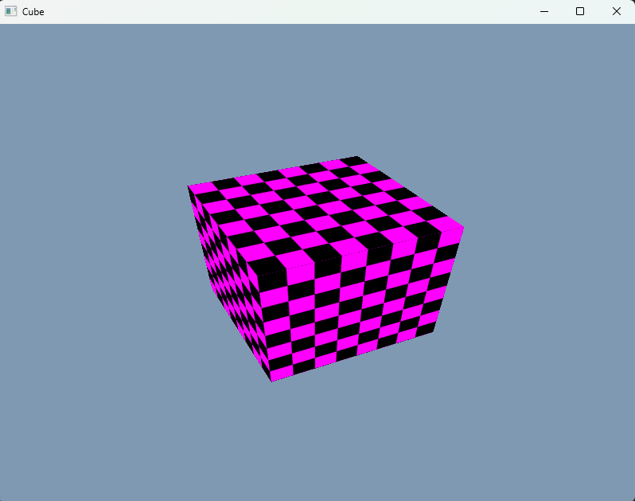
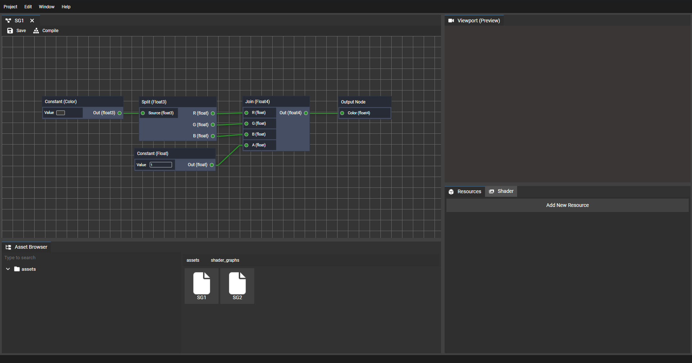

# IONENGINE - Image Open Next Engine

IONENGINE - is a only graphics engine written in modern C++23. The engine relies on the standard library and custom wrappers around the graphical APIs and window management.

The engine contains several small modules:

- Core
- Platform
- RHI (Render Hardware Interface)
- Shader System
- TXE (Texture format)
- MDL (Model format)
- Engine

## Features

- RHI around DirectX12 and Vulkan
- Bindless
- Render Graph
- GUI (RmlUI HTML/CSS)
- User-friendly engine API

## Roadmap

## Media

- Editor (Deprecated now)

