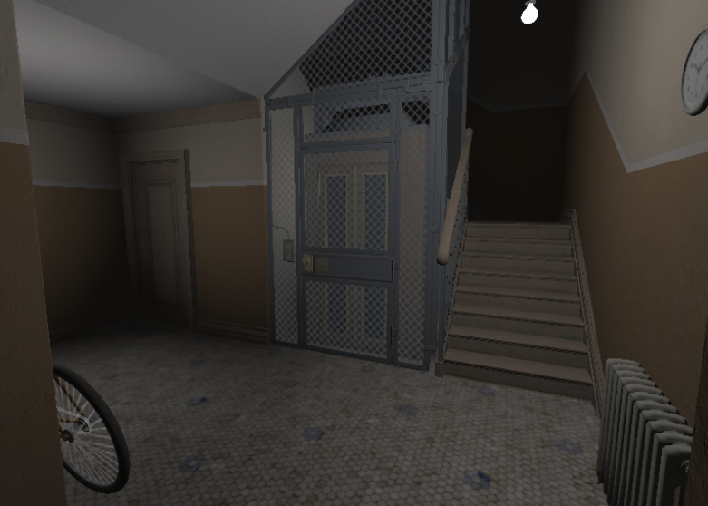

# 
 IONENGINE 

## 
 Realtime Renderer Project 

Lightweight renderer project for exploring and learning Graphics API

## Features

- Module architecture
- C++latest
- Graphics API backend
- Deffered/forward shading PBR
- Flexible material system
- Asset system with thread pool
- Async upload manager for GPU resources
- Minimum thirdparty dependinices

## Tasks

Renderer
  - [x] Async upload manager
  - [x] Frame graph
  - [ ] RmlUi integration
  - [x] Deffered shading PBR
  - [ ] Forward shading PBR

Library / platform
  - [x] Math library
  - [x] Cross-platform windowing
  - [x] Thread pool
  - [x] Logger
  - [x] Channel / event dispatcher

Asset
  - [x] Technique
  - [x] Texture
  - [x] Mesh
  - [x] Material
  - [ ] Subscene

## Screenshots 

