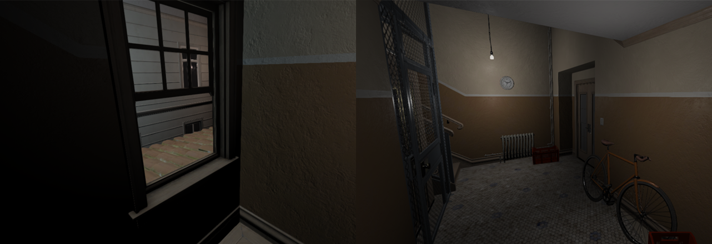

<h1 align="center">IONENGINE</h1>

**IONENGINE** (Image Open Engine) is an Graphic 3D Engine written in C++. It can be used to learn and exploring renderer techniques or write cross-platform C++ applications like games. A basic version of engine only includes **Renderer** module.

  

<h1 align="left">Features</h1>

* Cross-platform: Windows, Linux (Android in plan)
* Deffered/Forward physically-based rendering
* Async Asset System
* Modern Graphics API like Vulkan, DirectX12
* Job System-based architecture
* Node-based scene management
* HTML UI Library (RmlUI)

<h1 align="left">Dependencies</h1>

* [GLFW](https://github.com/glfw/glfw)
* [RmlUI](https://github.com/mikke89/RmlUi)
* [D3D12MA](https://github.com/GPUOpen-LibrariesAndSDKs/D3D12MemoryAllocator)
* [VMA](https://github.com/GPUOpen-LibrariesAndSDKs/VulkanMemoryAllocator)
* [TinyOBJLoader](https://github.com/tinyobjloader/tinyobjloader)
