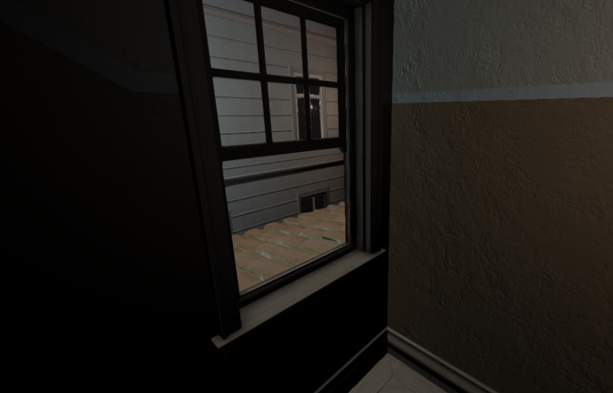
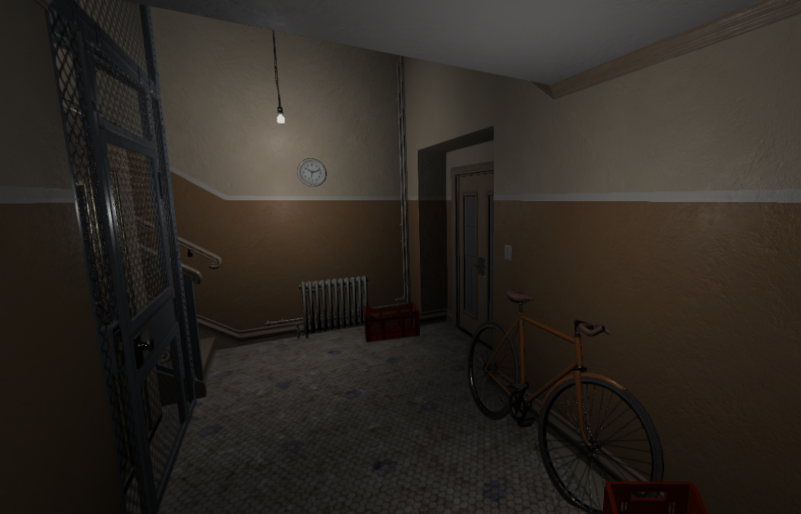

<h1 align="center">IONENGINE</h1>

**IONENGINE** (Image Open Engine) is an Graphic 3D Engine written in C++. It can be used to learn and exploring renderer techniques or write cross-platform C++ applications like games. A basic version of engine only includes **Renderer** module.

  

<h1 align="left">Features</h1>

* Cross-platform: Windows, Linux (Android in plan)
* Deffered/Forward physically-based rendering
* Async Asset System
* Modern Graphics API like Vulkan, DirectX12
* Job System-based architecture
* Node-based scene management
* HTML UI Library (RmlUI)

Renderer
  - [x] D3D12 backend
  - [ ] Pipeline disk cache
  - [ ] Upload manager /w Transition barrier engine
  - [x] Frame graph (only render pass support)
  - [x] RmlUI renderer integration
  - [x] Physically-based rendering
  - [x] Deffered shading
  - [x] Forward shading
  - [x] FXAA
  - [ ] TAA
  - [x] Material system
  - [ ] Spot light
  - [ ] Directional light
  - [x] Point light
  - [ ] Shadows

Library / platform
  - [x] Math library
  - [x] Cross-platform windowing / input (only Windows support)
  - [x] Thread pool
  - [x] Logger
  - [x] Channel / event dispatcher
  - [x] Expected / error handling

Input
  - [x] Base input system
  - [ ] Gamepad support

Asset
  - [x] Asset manager
  - [x] Asset loader
  - [x] Shader
  - [x] Texture
  - [x] Mesh
  - [x] Material
  - [ ] Subscene
  - [ ] Widget (User interface)
